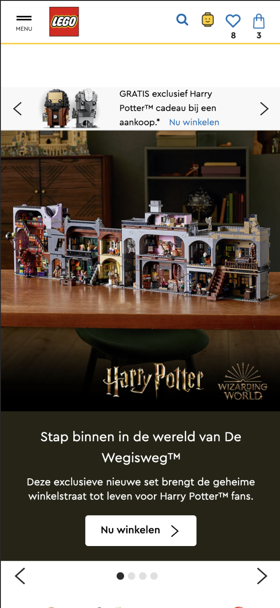
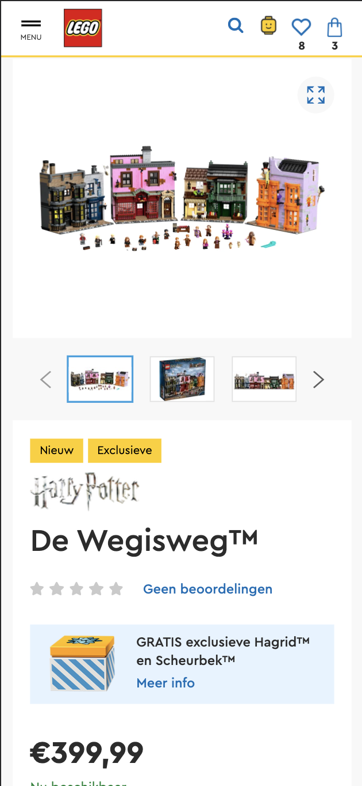
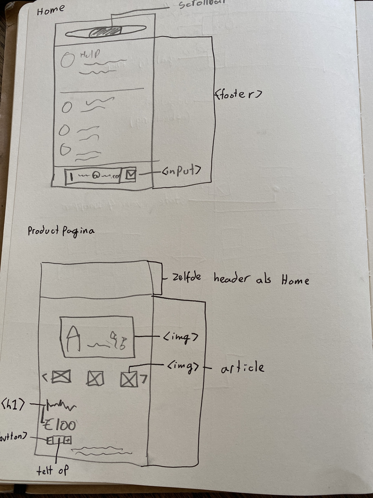
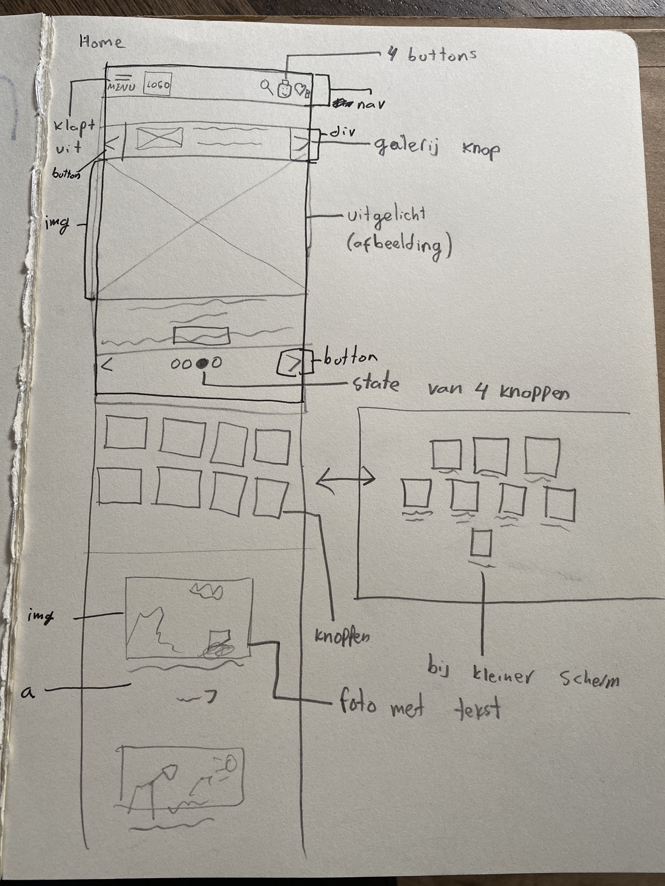

# Procesverslag
**Auteur:** Tom Mandemaker klas 209a

## Bronnenlijst
1. shop.lego.com
2. https://css-tricks.com/snippets/css/a-guide-to-flexbox/
3. -...-

## Eindgesprek (week 7/8)

-dit ging goed & dit was lastig-

**Screenshot(s):**

-screenshot(s) van je eindresultaat-

## Voortgang 3 (week 6)

-same as voortgang 1-

## Voortgang 2 (week 5)

-same as voortgang 1-

## Voortgang 1 (week 3)

### Stand van zaken

-dit ging goed & dit was lastig-

**Screenshot(s):**

(images/sc3.png)
(images/sc4.png)

### Agenda voor meeting

-samen met je groepje opstellen-

### Verslag van meeting

-na afloop snel uitkomsten vastleggen-

## Intake (week 1)

**Je startniveau:** Rood, ik heb voldoendes gehaald voor internetstandaarden en Inleiding programmeren en denk dat ik voldoende kennis heb over het coderen.

**Je focus:** Responsive

**Je opdracht:** shop.lego.com

**Screenshot(s):**

**Breakdown-schets(en):**

