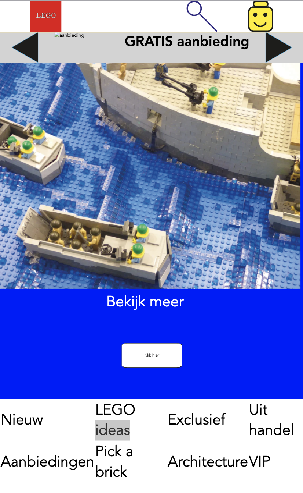

# Procesverslag
**Auteur:** Tom Mandemaker klas 209a

## Bronnenlijst
1. shop.lego.com
2. https://css-tricks.com/snippets/css/a-guide-to-flexbox/
3. https://www.w3schools.com/css/css_grid.asp

## Eindgesprek (week 7/8)

Ik vond het javascript erg lastig en heb dus minder compacte code gebruikt zodat ik uiteindelijk toch een gewenst resultaat had.
Ook het werken met grid, wat nieuw voor mij was vond ik een uitdaging maar het is naar mijn idee beter gegaan dan ik vooraf had verwacht.
**Screenshot(s):**

(images/sc5.png)
(images/sc6.png)
(images/sc7.png)
(images/sc8.png)

## Voortgang 3 (week 6)

agenda: Javascript slider, css slider

uiteindelijk heb ik de slider weggelaten omdat de originele site dat ook niet heeft gebruikt en ik de tijd liever wilde besteden aan het responsive maken van de site.

## Voortgang 2 (week 5)

agenda:
Binnen het groepje is hulp nodig voor:
Javascript slider
vraag over de propertie; position fixed & automatische transities van afbeeldingen
border menu vraag
vraag over mediaquery
vraag over js propertie
object-fit

## Voortgang 1 (week 3)

### Stand van zaken

Ik kreeg als tip dat ik beter kon beginnen met de css goed maken, terwijl ik wilde beginnen met
javascript omdat ik dat het lastigst vond.
Nu vind ik het inderdaad handiger om eerst het makkelijke werk te verrichten, zodat ik in ieder geval
iets heb om te laten zien.

**Screenshot(s):**

### Agenda voor meeting

github laten bekijken voor anderen, andere sites bekijken, beginnen met pagina 2.
flexbox oefenen, javascript voor slideshow maken

### Verslag van meeting

Ik kon het beste beginnen met de css. Als je begint met het makkelijke onderdeel loop je minder snel vast en heb je meer resultaat als je uiteindelijk ergens tegenaan loopt.

## Intake (week 1)

**Je startniveau:** Rood, ik heb voldoendes gehaald voor internetstandaarden en Inleiding programmeren en denk dat ik voldoende kennis heb over het coderen.

**Je focus:** Responsive

**Je opdracht:** shop.lego.com

**Screenshot(s):**

**Breakdown-schets(en):**

